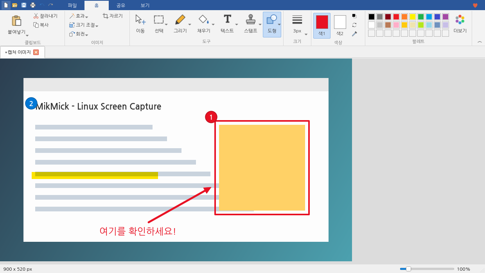
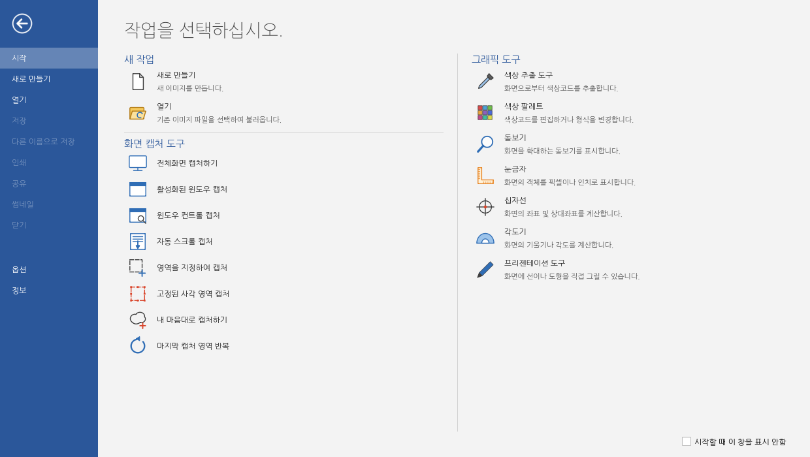
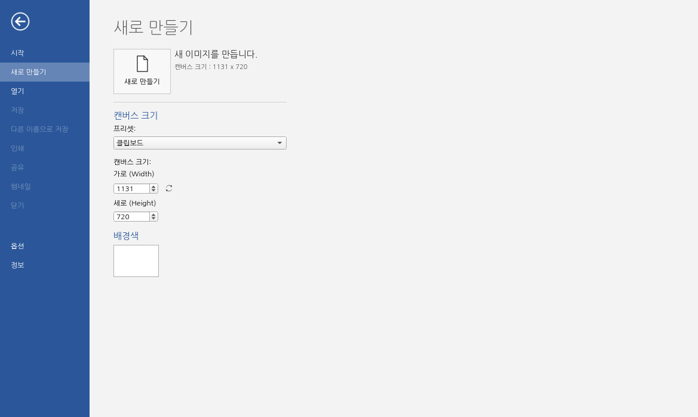
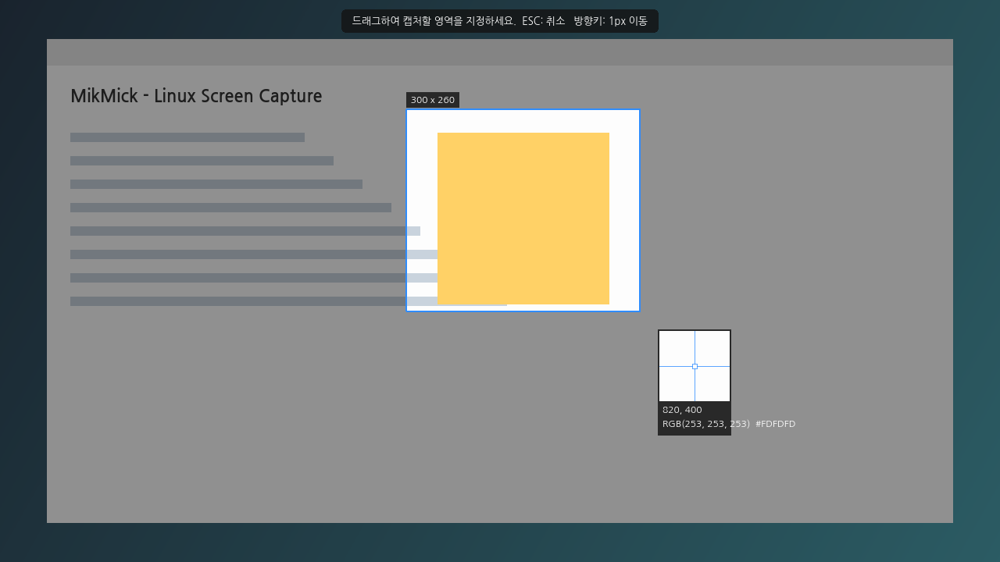
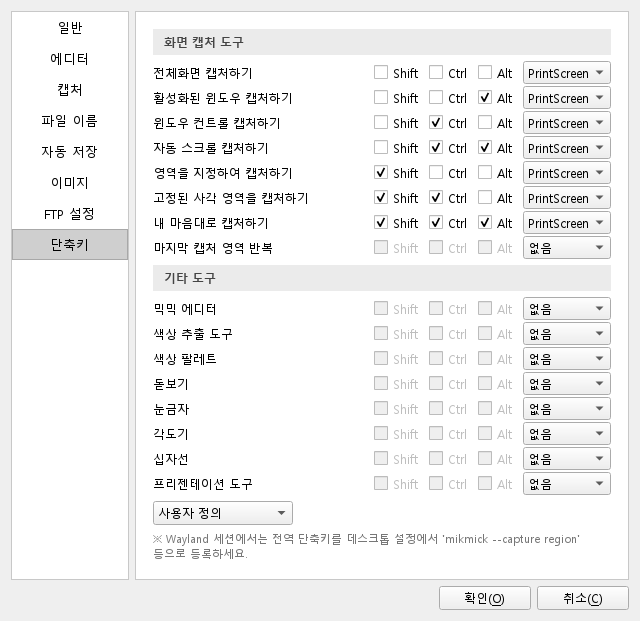

<p align="center">
  
</p>

<h1 align="center">믹믹 (MikMick)</h1>

<p align="center">
  <b>리눅스를 위한 올인원 화면 캡처 · 이미지 편집 · 디자인 도구</b><br>
  캡처하고, 편집하고, 공유하는 일을 한 곳에서.
</p>

<p align="center">
  <a href="https://github.com/KaiHT-Ladiant/MikMick/actions/workflows/ci.yml"></a>
  <a href="https://github.com/KaiHT-Ladiant/MikMick/releases/latest"></a>
  <a href="LICENSE"></a>
  
  
  
</p>

---

Windows 에서 오랫동안 사랑받아 온 [픽픽(PicPick)](https://picpick.app/ko/)은 공식적으로 Mac/Linux 버전 계획이 없습니다.
**믹믹(MikMick)** 은 픽픽의 사용 경험(리본 스타일 에디터, 다양한 캡처 모드, 그래픽 도구 모음, 옵션 구성)을
리눅스 데스크톱에서 그대로 누릴 수 있도록 처음부터 새로 만든 **무료 오픈소스** 프로그램입니다.
C++17 과 Qt 6 로 작성되어 가볍고 빠르게 실행되며, 별도의 런타임 없이 실행 파일 하나로 동작합니다.

> 믹믹은 PicPick 및 NGWIN 과 제휴 관계가 없는 독립 프로젝트이며, PicPick 의 코드나 리소스를 사용하지 않습니다.



## 주요 기능

### 화면 캡처 도구
| 모드 | 설명 |
| --- | --- |
| 전체화면 캡처하기 | 다중 모니터를 포함한 전체 화면 |
| 활성화된 윈도우 캡처 | 현재 포커스된 창 (창 테두리 포함) |
| 윈도우 컨트롤 캡처 | 마우스로 가리킨 창을 하이라이트하여 선택 |
| 자동 스크롤 캡처 | 스크롤하며 여러 장을 찍어 겹치는 부분을 찾아 자동으로 이어 붙임 |
| 영역을 지정하여 캡처 | 드래그로 영역 지정, 화면 확대창(돋보기)과 픽셀 좌표·색상 표시 |
| 고정된 사각 영역 캡처 | 지정한 크기의 사각형을 원하는 위치에 놓고 캡처 (휠로 크기 조절) |
| 내 마음대로 캡처하기 | 자유 곡선으로 영역을 그려 캡처 (바깥은 투명 처리) |
| 마지막 캡처 영역 반복 | 직전에 캡처한 영역을 다시 캡처 |

- 캡처 지연 시간, 마우스 커서 포함, 효과음, 항상 클립보드에 저장
- 캡처 결과: 믹믹 에디터 / 클립보드 / 파일로 저장 / 자동 저장 / FTP 전송 / 외부 프로그램 연결
- 자동 저장 파일 이름 패턴: `%y %m %d %h %n %s %c %u %w %t`

### 이미지 에디터 (리본 UI)
- **파일(백스테이지)**: 시작, 새로 만들기(프리셋·캔버스 크기·배경색), 열기, 저장, 다른 이름으로 저장, 인쇄, 공유, 썸네일, 닫기, 옵션, 정보
- **홈**: 클립보드(붙여넣기/잘라내기/복사), 이미지(효과/크기 조절/회전/자르기), 도구(이동/선택/그리기/채우기/텍스트/스탬프/도형), 선 굵기, 색1·색2, 팔레트
- **공유**: 클립보드, 이메일(`xdg-email`), FTP, 외부 프로그램, 기본 앱으로 열기
- **보기**: 확대/축소, 100%, 화면에 맞추기, 단색/격자 배경, 상태 표시줄, 개체 병합
- 도형·화살표·말풍선·펜·형광펜·텍스트·번호 스탬프는 **개체로 유지**되어 이동/삭제/실행 취소가 가능하고, 저장하거나 효과를 적용할 때 이미지에 병합됩니다.
- 효과: 흐리게, 선명하게, 모자이크, 무채화, 색반전, 밝기/대비, 색조/채도, 테두리, 그림자, 워터마크
- 저장 형식: PNG, JPEG(화질 설정), BMP, GIF, WebP, TIFF, PDF

### 그래픽 도구
| 도구 | 설명 |
| --- | --- |
| 색상 추출 도구 | 화면의 픽셀 색상을 돋보기와 함께 추출, HTML/HEX/RGB/HSB/C++/Delphi 형식 복사 |
| 색상 팔레트 | RGB/HSV 색상 편집, 자주 쓰는 색 저장 |
| 돋보기 | 마우스 주변을 실시간 확대 (휠로 배율 변경) |
| 눈금자 | 가로/세로 전환, 픽셀·인치·센티미터, DPI 설정 |
| 십자선 | 절대 좌표 및 기준점 대비 상대 좌표·거리 |
| 각도기 | 세 점을 찍어 각도 측정 |
| 프리젠테이션 도구 | 바탕 화면 위에 펜·형광펜·도형으로 직접 그리기 (투명/화면/흰색/검정 배경) |

### 기타
- 알림 영역(트레이) 아이콘 메뉴, 단일 인스턴스, 로그인 시 자동 실행
- 전역 단축키 (기본값은 픽픽과 동일: `PrintScreen`, `Alt+PrintScreen`, `Shift+PrintScreen` …)
  - X11: XCB 로 직접 등록, Wayland: xdg-desktop-portal GlobalShortcuts (지원하는 데스크톱에서)
- 업데이트 확인 (GitHub Releases)

## 스크린샷

| 시작 화면 | 새로 만들기 |
| --- | --- |
|  |  |

| 영역 지정 캡처 | 옵션 - 단축키 |
| --- | --- |
|  |  |

## 다운로드

[Releases](https://github.com/KaiHT-Ladiant/MikMick/releases/latest) 페이지에서 배포판에 맞는 패키지를 받으세요.
모든 패키지는 릴리스마다 CI 에서 아래 배포판 컨테이너에 실제로 설치해 실행까지 확인합니다.

| 패키지 | 대상 | 설치 테스트를 통과한 배포판 |
| --- | --- | --- |
| `mikmick_<버전>_amd64.deb` | Debian / Ubuntu 계열 (Linux Mint, Pop!_OS, Kali …) | Ubuntu 22.04 · 24.04, Debian 12 · 13 |
| `mikmick-<버전>-1.x86_64.rpm` | Fedora / openSUSE 계열 | Fedora 43 · 최신, openSUSE Tumbleweed |
| `mikmick-<버전>-1-x86_64.pkg.tar.zst` | Arch 계열 (Manjaro, EndeavourOS …) | Arch Linux |
| `MikMick-<버전>-x86_64.AppImage` | 설치 없이 실행 (Qt 포함, glibc 2.35 이상) | Ubuntu 22.04, Debian 13, Fedora 최신, openSUSE Tumbleweed, Arch Linux |

```bash
sudo apt install ./mikmick_*_amd64.deb                         # Debian / Ubuntu
sudo dnf install ./mikmick-*.x86_64.rpm                        # Fedora
sudo zypper install --allow-unsigned-rpm ./mikmick-*.x86_64.rpm  # openSUSE
sudo pacman -U ./mikmick-*-x86_64.pkg.tar.zst                  # Arch
chmod +x MikMick-*-x86_64.AppImage && ./MikMick-*-x86_64.AppImage
```

> deb/rpm/Arch 패키지는 배포판의 Qt 6 를 사용하므로 가볍고, AppImage 는 Qt 를 내장해 배포판과 무관하게 실행됩니다.
> AppImage 는 Wayland 세션에서 XWayland 로 동작하며, 캡처와 전역 단축키는 deb/rpm 과 동일하게 xdg-desktop-portal 을 사용합니다.
> Arch 사용자는 릴리스에 첨부된 `PKGBUILD` 로 직접 빌드할 수도 있습니다. 파일 무결성은 `SHA256SUMS` 로 확인하세요.

## 설치 (소스에서 빌드)

### 1. 빌드 도구와 라이브러리

```bash
# Debian / Ubuntu / Kali
sudo apt install cmake ninja-build g++ qt6-base-dev \
  libxcb1-dev libxcb-keysyms1-dev libxcb-xtest0-dev libxcb-xfixes0-dev

# Fedora
sudo dnf install cmake ninja-build gcc-c++ qt6-qtbase-devel libxcb-devel xcb-util-keysyms-devel

# Arch
sudo pacman -S cmake ninja gcc qt6-base libxcb xcb-util-keysyms
```

> Qt 6.2 이상이 필요합니다. XCB 개발 패키지가 없으면 X11 전용 기능(창 선택, 자동 스크롤, X11 전역 단축키) 없이 빌드됩니다.
> FTP 전송에는 `curl`, Wayland 환경의 화면 획득 대체 수단으로 `grim` / `gnome-screenshot` / `spectacle` 중 하나가 쓰일 수 있습니다.

### 2. 빌드 & 설치

```bash
git clone https://github.com/KaiHT-Ladiant/MikMick.git
cd MikMick
./scripts/install.sh          # 빌드 후 ~/.local 에 설치 + 앱 메뉴/아이콘 등록
```

또는 직접:

```bash
cmake -S . -B build -G Ninja -DCMAKE_BUILD_TYPE=Release
cmake --build build
sudo cmake --install build    # /usr/local
```

제거: `./scripts/install.sh --uninstall`

## 사용법

```bash
mikmick                          # 에디터(시작 화면) 실행
mikmick --tray                   # 알림 영역에만 표시
mikmick image.png                # 이미지 열기
mikmick --capture region         # 영역 지정 캡처
mikmick --capture fullscreen --delay 3000
mikmick --tool color_picker      # 색상 추출 도구
mikmick --options                # 옵션
```

캡처 모드: `fullscreen`, `active_window`, `window_control`, `scroll`, `region`, `fixed`, `freehand`, `repeat_last`
그래픽 도구: `editor`, `color_picker`, `palette`, `magnifier`, `ruler`, `crosshair`, `protractor`, `whiteboard`

믹믹이 이미 실행 중이면 명령은 실행 중인 인스턴스로 전달됩니다.

### X11 / Wayland 지원 현황

| 기능 | X11 | Wayland |
| --- | :---: | :---: |
| 전체화면 / 영역 / 고정 영역 / 자유형 캡처 | ✅ | ✅ (xdg-desktop-portal 또는 `grim`, `gnome-screenshot`, `spectacle`) |
| 활성 창 / 창 선택 캡처 | ✅ | ⚠️ 영역 지정으로 대체 |
| 자동 스크롤 캡처 | ✅ (XTest) | ❌ |
| 실시간 돋보기 | ✅ | ⚠️ 정지 화면 기준 |
| 전역 단축키 | ✅ (XCB) | ⚠️ GlobalShortcuts 포털 지원 시 자동, 아니면 데스크톱 설정에서 등록 |

X11 에서 `Ctrl+Alt+F1`~`F12` 는 가상 콘솔 전환에 쓰이므로 전역 단축키로 사용할 수 없습니다.

**Wayland(GNOME/KDE) 단축키 등록 예시**: 설정 → 키보드 → 사용자 지정 단축키에서
명령 `mikmick --capture region`, 단축키 `Shift+Print` 처럼 등록하세요.
GNOME 은 기본적으로 `Print` 키를 자체 스크린샷에 사용하므로 기존 단축키를 해제해야 할 수 있습니다.

## 설정 파일

`~/.config/mikmick/config.json` 에 저장됩니다. 자동 저장 기본 폴더는 `~/Pictures/MikMick` 입니다.

## 개발

```bash
cmake -S . -B build -G Ninja
cmake --build build
ctest --test-dir build --output-on-failure   # QT_QPA_PLATFORM=offscreen 으로 실행됨
./build/mikmick
```

README 스크린샷 다시 만들기: `./build/tests/mikmick-screenshots docs/screenshots`

모듈 하나만 빠르게 컴파일해 보려면 `-DMIKMICK_ONLY_MODULE=editor` 처럼 지정합니다.

```
src/
├── app/       # 진입점(CLI), 트레이, 단일 인스턴스(IPC), 캡처 결과 처리
├── core/      # 설정, 파일 이름 패턴, 저장/클립보드/FTP/외부 프로그램, 자동 실행·업데이트
├── capture/   # 화면 획득(X11/Wayland 포털), XCB 창 정보, 선택 오버레이, 스크롤 캡처
├── editor/    # 리본 에디터, 백스테이지, 캔버스·개체, 효과
├── tools/     # 색상 추출/팔레트, 돋보기, 눈금자, 십자선, 각도기, 프리젠테이션
├── options/   # 옵션 대화상자(8개 페이지), 전역 단축키(XCB / GlobalShortcuts 포털)
└── ui/        # QPainter 벡터 아이콘
```

> 0.1.0 은 Python(PySide6)으로 작성되었으며 [`python-v0.1.0`](https://github.com/KaiHT-Ladiant/MikMick/tree/python-v0.1.0) 태그에 보존되어 있습니다.

## 로드맵

- [ ] 화면 녹화 (PipeWire / ffmpeg)
- [ ] 클라우드 업로드 (Google 드라이브, 드롭박스 등)
- [ ] 개체 크기 조절 핸들, 레이어 순서 변경
- [ ] Flatpak / AppImage / .deb 패키지 및 릴리스 바이너리
- [ ] 다국어(영어) UI

## 만든 사람

- **Kai_HT** ([@KaiHT-Ladiant](https://github.com/KaiHT-Ladiant))

## 라이선스

[MIT](LICENSE) © 2026 Kai_HT
